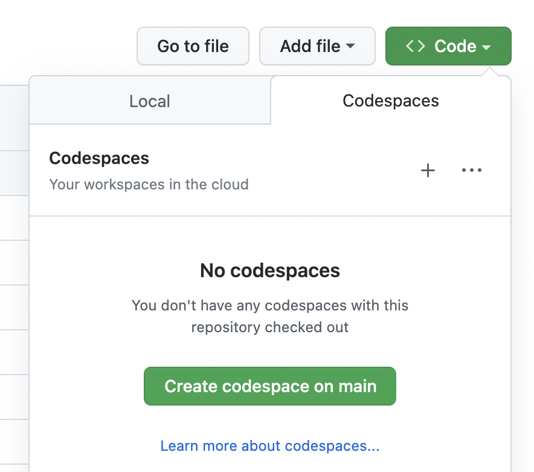
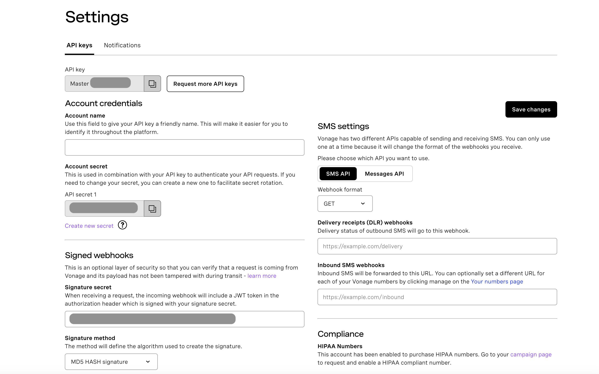
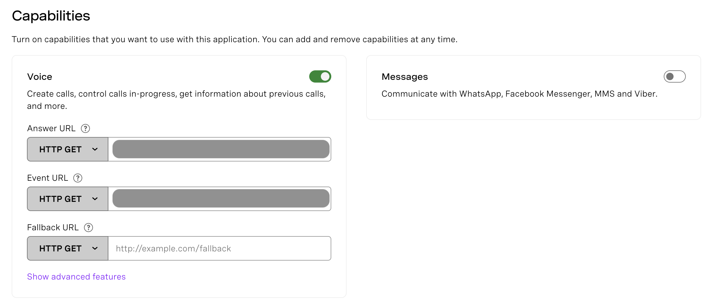
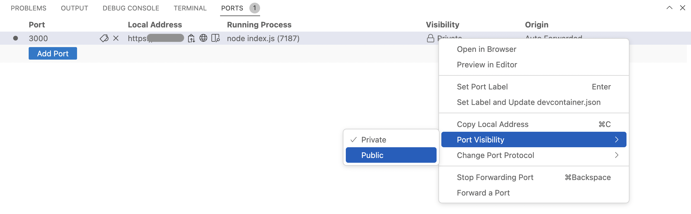

## Integrate Phone Calls and SMS with OpenAI

Full workflow here [https://developer.vonage.com/en/blog/integrate-phone-calls-and-sms-with-openai](https://developer.vonage.com/en/blog/integrate-phone-calls-and-sms-with-openai)

We've already developed a starter Vonage Voice application to receive a call, catch your response, and send it to a 3rd party (OpenAI).
Users can deploy the App using Github Codespaces.
Fork [this repository](https://github.com/Vonage-Community/tutorial-voice-messages-node-openai-integration). Open it in Codespaces by clicking "Create codespace on main"




## Create a new Vonage app
In the left menu [here](https://dashboard.nexmo.com/), click API Settings, left menu item.



Copy and paste in the `.env` file API key and API Secret

```
API_KEY=b**********
API_SECRET=******************
```

**OpenAI API**

After [registering](https://beta.openai.com/signup)  and confirming your phone number, you need to generate your [API key](https://beta.openai.com/account/api-keys).

With this API key, we can move forward.

Paste it to your `.env` file

```
API_KEY=b**********
API_SECRET=******************
OPENAI_API_KEY=sk-**************************************
```

## Deploy Our App in Codespace

Open GitHub Codespace in your fork.

In the Codespace terminal, run the following command to install our Node packages:

```
npm install
```

Run the following command in the terminal to receive the GitHub Codespace URL for webhooks

```
echo "https://${CODESPACE_NAME}-3000.preview.app.github.dev/webhooks/asr" 
```

Copy and paste the output in `EVENT_URL=` in the `.env` file

```
API_KEY=b**********
API_SECRET=******************
OPENAI_API_KEY=sk-**************************************
EVENT_URL=https://******************************************-3000.preview.app.github.dev/webhooks/asr
```

You will need to provide an answer URL for the application you create that corresponds to the answer route provided in the `.env` file. The answer URL needs to be an externally accessible URL that ends with /webhooks/answer. For example, if your URL was example.com, then your answer URL would be http://example.com/webhooks/answer.

Update App settings using [Dashboard](https://dashboard.nexmo.com/). Go to Application in the left menu. Choose a related app and  click the 'Edit' button



Run the App

```bash
node index.js
```

In the terminal, open the `Port` tab. Click on `Private` in the `Visibility` column, and change it to `Public`.



Everything is ready

* Try this out by calling the number that is linked with the app `**732**56**`
* Tell the bot your tip
* Wait for the content in the corresponding messenger
* Monitor the console


